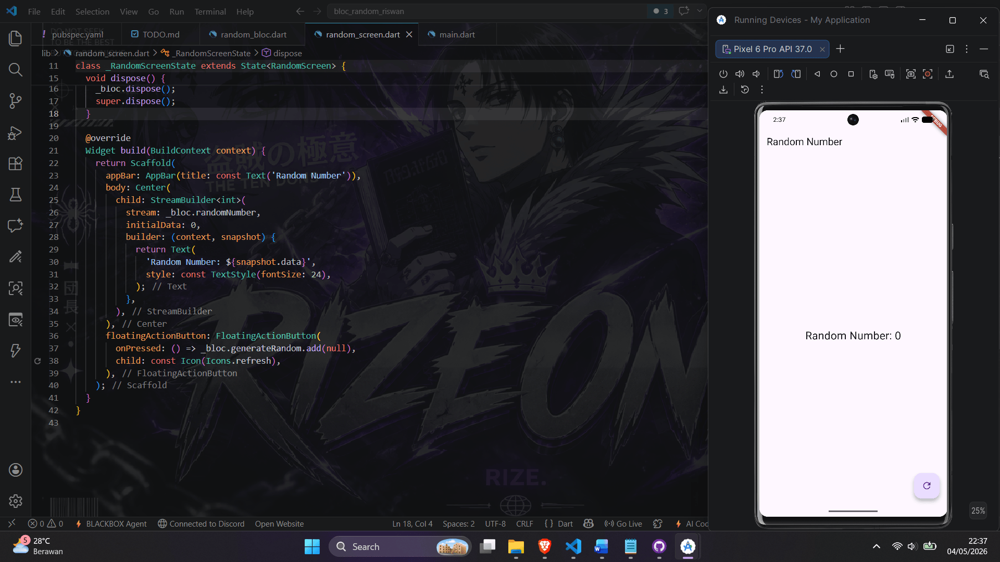

# bloc_random_riswan - Week 12 Praktikum

Flutter app with stream-based RandomNumberBloc.

## Demo GIF

## Features
- RandomNumberBloc with StreamControllers for generateRandom and randomNumber (0-9)
- RandomScreen with StreamBuilder UI
- Proper dispose lifecycle

## Langkah Implemented
3-13: Bloc class, streams, constructor, UI integration, etc.

Repo: https://github.com/Rizeone/bloc_random_riswan
